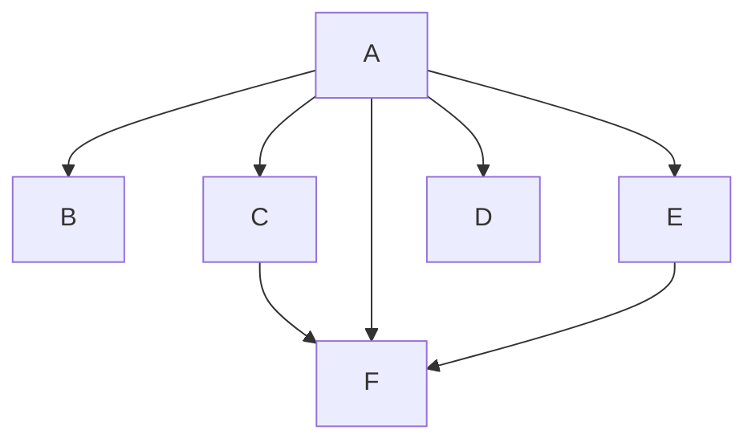
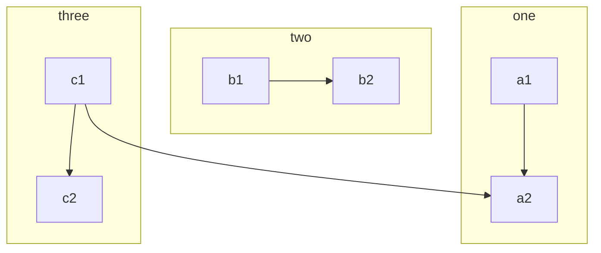

### [流程图](https://github.com/knsv/mermaid#flowchart)

```mermaid
graph TD;
  A-->B;
  A-->C;
  C-->F
  A-->E;
  A-->D;
  A-->F;
  E-->F;
```

```mermaid
graph TB
  c1-->a2
  subgraph one
  a1-->a2
  end
  subgraph two
  b1-->b2
  end
  subgraph three
  c1-->c2
  end
```
