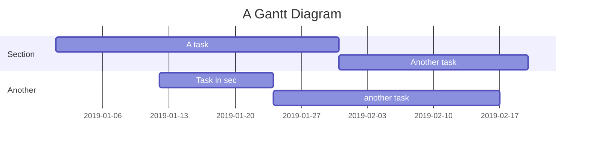
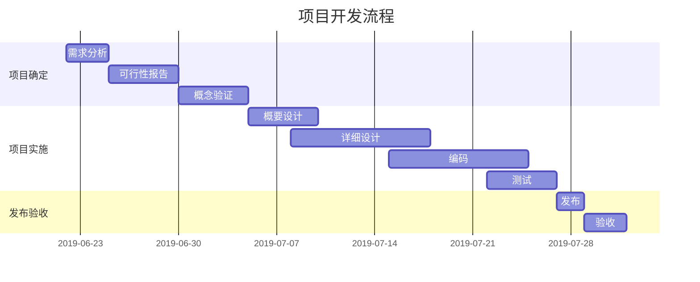

### [甘特图](https://github.com/knsv/mermaid#gantt-diagram)

>**甘特图**内在思想简单。基本是一条线条图，横轴表示时间，纵轴表示活动（项目），线条表示在整个期间上计划和实际的活动完成情况。它直观地表明任务计划在什么时候进行，及实际进展与计划要求的对比。

```mermaid
gantt
  title A Gantt Diagram
  dateFormat  YYYY-MM-DD
  section Section
  A task           :a1, 2019-01-01, 30d
  Another task     :after a1  , 20d
  section Another
  Task in sec      :2019-01-12  , 12d
  another task     : 24d
```

```mermaid
gantt
  title 项目开发流程
  section 项目确定
    需求分析       :a1, 2019-06-22, 3d
    可行性报告     :after a1, 5d
    概念验证       : 5d
  section 项目实施
    概要设计      :2019-07-05  , 5d
    详细设计      :2019-07-08, 10d
    编码          :2019-07-15, 10d
    测试          :2019-07-22, 5d
  section 发布验收
    发布: 2d
    验收: 3d
```
