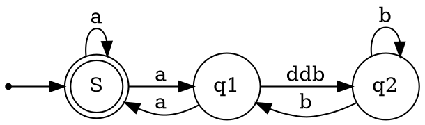
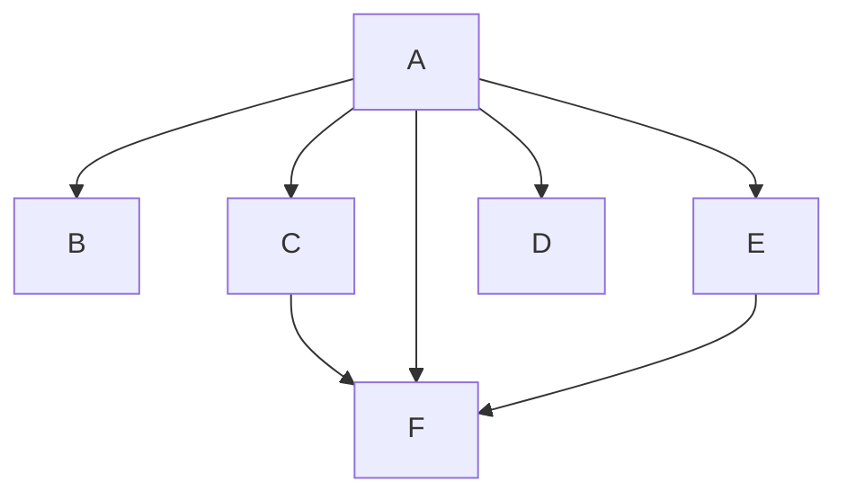
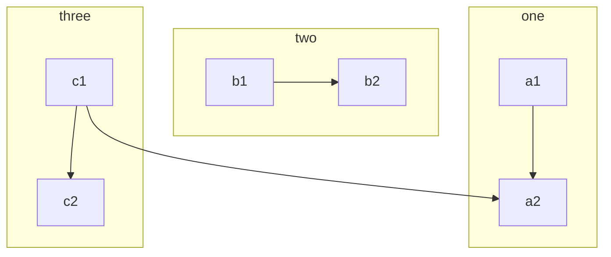
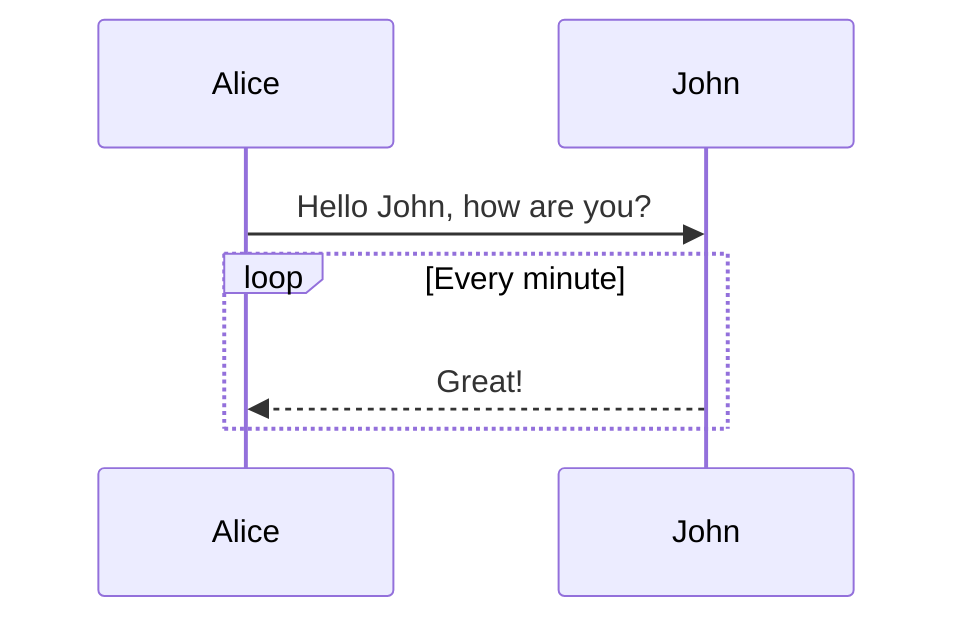
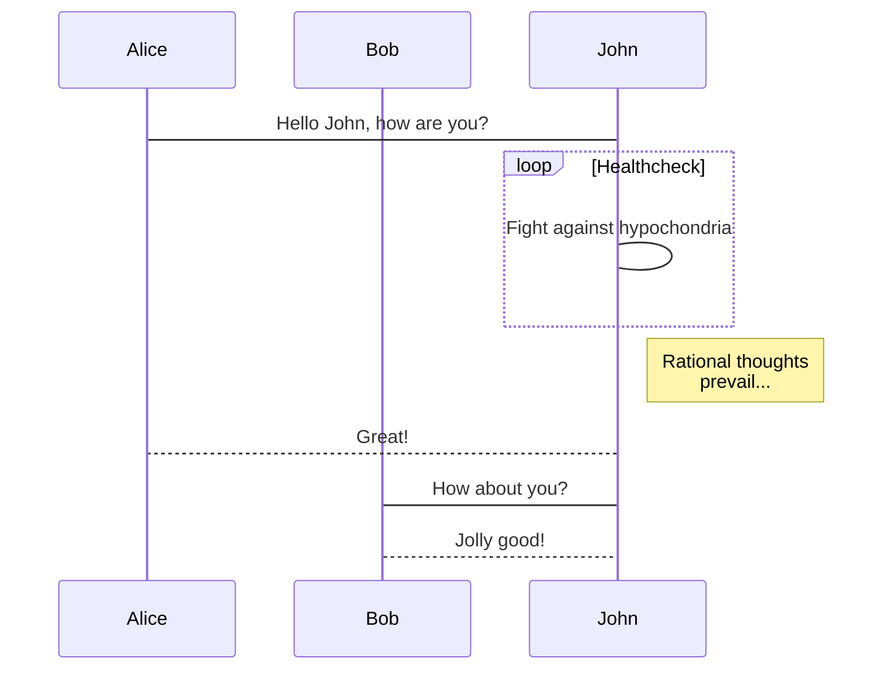
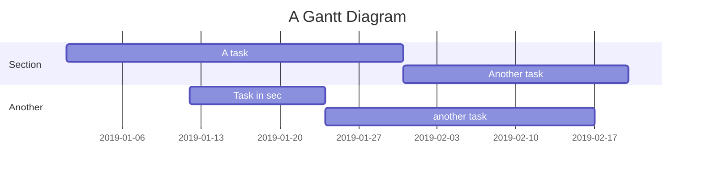
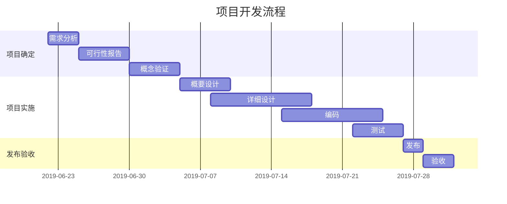

### 1. 数学公式

多行公式块：

$$
\frac{1}{
  \Bigl(\sqrt{\phi \sqrt{5}}-\phi\Bigr) e^{
  \frac25 \pi}} = 1+\frac{e^{-2\pi}} {1+\frac{e^{-4\pi}} {
    1+\frac{e^{-6\pi}}
    {1+\frac{e^{-8\pi}}{1+\cdots}}
  }
}
$$

行内公式：

公式 $a^2 + b^2 = \color{red}c^2$ 是行内。

### 2. Graphviz



### 3. [流程图](https://github.com/knsv/mermaid#flowchart)





### 4. [时序图](https://github.com/knsv/mermaid#sequence-diagram)





### 5. [甘特图](https://github.com/knsv/mermaid#gantt-diagram)

>**甘特图**内在思想简单。基本是一条线条图，横轴表示时间，纵轴表示活动（项目），线条表示在整个期间上计划和实际的活动完成情况。它直观地表明任务计划在什么时候进行，及实际进展与计划要求的对比。





### 6. 图表

```echarts
{
  "backgroundColor": "#212121",
  "title": {
    "text": "「晚晴幽草轩」访问来源",
    "subtext": "2019 年 6 月份",
    "x": "center",
    "textStyle": {
      "color": "#f2f2f2"
    }
  },
  "tooltip": {
    "trigger": "item",
    "formatter": "{a} <br/>{b} : {c} ({d}%)"
  },
  "legend": {
    "orient": "vertical",
    "left": "left",
    "data": [
      "搜索引擎",
      "直接访问",
      "推荐",
      "其他",
      "社交平台"
    ],
    "textStyle": {
      "color": "#f2f2f2"
    }
  },
  "series": [
    {
      "name": "访问来源",
      "type": "pie",
      "radius": "55%",
      "center": [
        "50%",
        "60%"
      ],
      "data": [
        {
          "value": 10440,
          "name": "搜索引擎",
          "itemStyle": {
            "color": "#ef4136"
          }
        },
        {
          "value": 4770,
          "name": "直接访问"
        },
        {
          "value": 2430,
          "name": "推荐"
        },
        {
          "value": 342,
          "name": "其他"
        },
        {
          "value": 18,
          "name": "社交平台"
        }
      ],
      "itemStyle": {
        "emphasis": {
          "shadowBlur": 10,
          "shadowOffsetX": 0,
          "shadowColor": "rgba(0, 0, 0, 0.5)"
        }
      }
    }
  ]
}
```

```echarts
{
  "title": { "text": "最近 30 天" },
  "tooltip": { "trigger": "axis", "axisPointer": { "lineStyle": { "width": 0 } } },
  "legend": { "data": ["帖子", "用户", "回帖"] },
  "xAxis": [{
    "type": "category",
    "boundaryGap": false,
    "data": ["2019-05-08","2019-05-09","2019-05-10","2019-05-11","2019-05-12","2019-05-13","2019-05-14","2019-05-15","2019-05-16","2019-05-17","2019-05-18","2019-05-19","2019-05-20","2019-05-21","2019-05-22","2019-05-23","2019-05-24","2019-05-25","2019-05-26","2019-05-27","2019-05-28","2019-05-29","2019-05-30","2019-05-31","2019-06-01","2019-06-02","2019-06-03","2019-06-04","2019-06-05","2019-06-06","2019-06-07"],
    "axisTick": { "show": false },
    "axisLine": { "show": false }
  }],
  "yAxis": [{ "type": "value", "axisTick": { "show": false }, "axisLine": { "show": false }, "splitLine": { "lineStyle": { "color": "rgba(0, 0, 0, .38)", "type": "dashed" } } }],
  "series": [
    {
      "name": "帖子", "type": "line", "smooth": true, "itemStyle": { "color": "#d23f31" }, "areaStyle": { "normal": {} }, "z": 3,
      "data": ["18","14","22","9","7","18","10","12","13","16","6","9","15","15","12","15","8","14","9","10","29","22","14","22","9","10","15","9","9","15","0"]
    },
    {
      "name": "用户", "type": "line", "smooth": true, "itemStyle": { "color": "#f1e05a" }, "areaStyle": { "normal": {} }, "z": 2,
      "data": ["31","33","30","23","16","29","23","37","41","29","16","13","39","23","38","136","89","35","22","50","57","47","36","59","14","23","46","44","51","43","0"]
    },
    {
      "name": "回帖", "type": "line", "smooth": true, "itemStyle": { "color": "#4285f4" }, "areaStyle": { "normal": {} }, "z": 1,
      "data": ["35","42","73","15","43","58","55","35","46","87","36","15","44","76","130","73","50","20","21","54","48","73","60","89","26","27","70","63","55","37","0"]
    }
  ]
}
```

>**备注**：上述 echarts 图表📈，其数据，须使用严格的 **JSON** 格式；您可使用 JSON.stringify(data)，将对象传换从而得标准数据，即可正常使用。

### 7. 五线谱

```abc
X: 24
T: Clouds Thicken
C: Paul Rosen
S: Copyright 2005, Paul Rosen
M: 6/8
L: 1/8
Q: 3/8=116
R: Creepy Jig
K: Em
|:"Em"EEE E2G|"C7"_B2A G2F|"Em"EEE E2G|\
"C7"_B2A "B7"=B3|"Em"EEE E2G|
"C7"_B2A G2F|"Em"GFE "D (Bm7)"F2D|\
1"Em"E3-E3:|2"Em"E3-E2B|:"Em"e2e gfe|
"G"g2ab3|"Em"gfeg2e|"D"fedB2A|"Em"e2e gfe|\
"G"g2ab3|"Em"gfe"D"f2d|"Em"e3-e3:|
```

### 8. 多媒体

支持 v.qq.com，youtube.com，youku.com，coub.com，facebook.com/video，dailymotion.com，.mp4，.m4v，.ogg，.ogv，.webm，.mp3，.wav 链接解析

https://v.qq.com/x/cover/zf2z0xpqcculhcz/y0016tj0qvh.html
